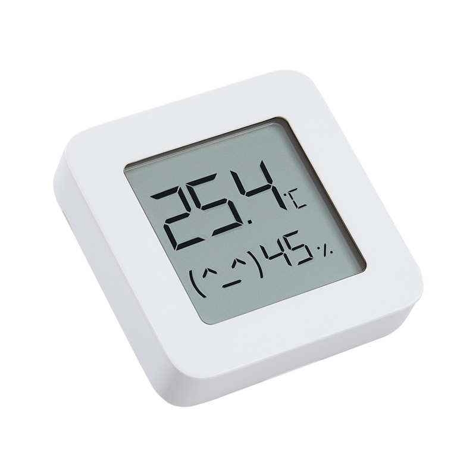
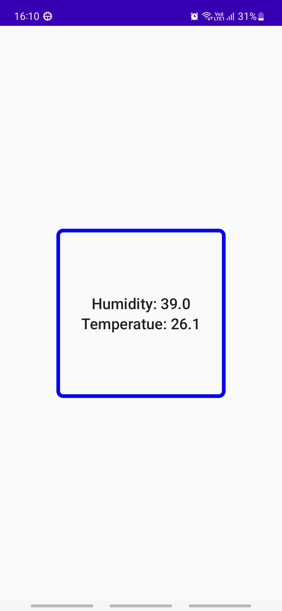

BluetoothLowEnergy(BLE)Example
===========

An application that show temperature and humidity from BLE sensor.

A solid app with relevant concepts:
* Scan, connect and get data from BLE sensor using BluetoothAdapter
* Request Bluetooth permission and setting
* Jetpack Compose

Getting Started
---------------

This app use Mi Temperature and Humidity Monitor 2 as BLE device. Different devices have different
SERVICE_UUID and CHARACTERISTIC_UUID to get data from. You can use Bluetooth LE Explorer app from Microsoft Store to find BLE device info.

Please allow permissions for app to run properly.

Screenshots
-----------

